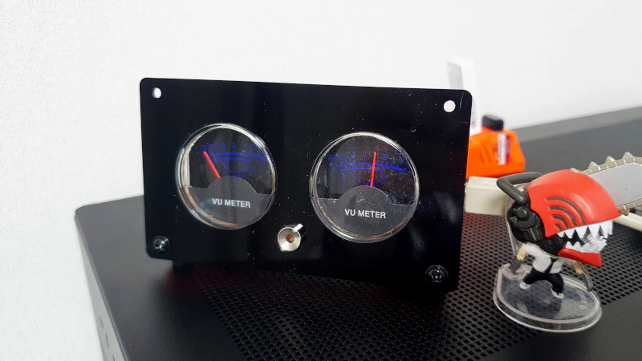

# metric_gauge - Analog gauge to display machine metrics



## Arduino

Send following command to set left and right gauge

```
A={0~100},{0~100}\n
```

## Build & Run metric_gauge daemon

Build docker image:

```bash
docker build -t dev/metric_gauge:latest .
```

Run with device file attach:

```bash
docker run \
  -d --restart unless-stopped \
  --device /dev/ttyUSB0 \
  --name metric_gauge \
    dev/metric_gauge:latest
```
